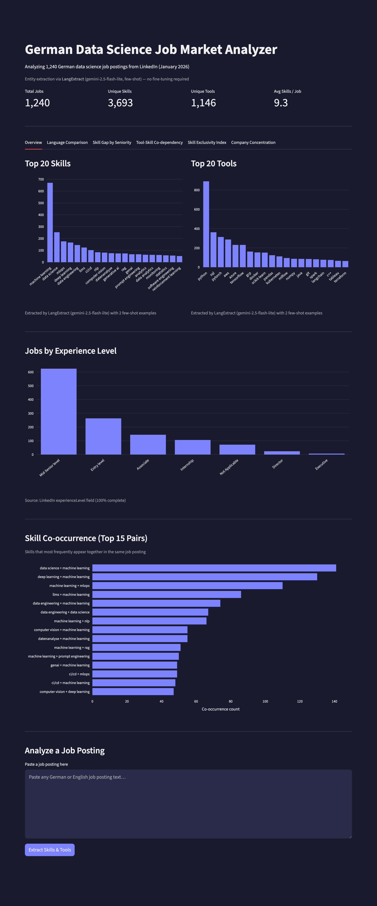

# 🇩🇪 German Data Jobs Analyzer

> A multilingual NLP pipeline that extracts skills and tools from 1,240 German and English data science job postings — combining a fine-tuned NER model with LLM-based extraction via LangExtract — with an interactive Streamlit dashboard offering five layers of analysis of the German AI/ML job market.



*Six-tab interactive dashboard — [view live demo](#) (update link after Streamlit deployment)*

---

## 📊 Key Findings

Analysis of **1,240 LinkedIn job postings** for Data Science, Machine Learning, and AI roles in Germany (January 2026):

- **Python dominates**: Mentioned in ~48% of all postings, making it the clear baseline expectation
- **LLMs are mainstream**: GenAI, LLMs, and RAG appear together in a significant share of postings — generative AI is no longer a niche requirement
- **The cloud triumvirate**: AWS (180), Azure (143), and GCP (88) all feature heavily — cloud proficiency is expected, not optional
- **MLOps is rising**: MLflow, Kubeflow, and MLOps as a skill appear frequently, especially in Mid-Senior roles, signaling maturity in how German companies deploy ML
- **Deep learning frameworks**: PyTorch (171) edges out TensorFlow (138), especially at entry and mid-senior level
- **German-language postings are real**: 44% of analyzed postings are in German, confirming that multilingual NLP is practically relevant — not just academically interesting
- **Average job requires 11.7 skills and 4 tools**, suggesting roles are increasingly hybrid and cross-functional
- **Language signals company origin**: German-language postings use German terminology (KI, Datenanalyse) and likely represent local companies. English postings skew toward internationally-framed terms (MLOps, LLMs). Director roles are 4x more likely to be posted in English.
- **The career ladder is real**: Only deep learning and computer vision appear as evergreen skills across all seniority levels. Entry-level roles are dominated by LLMs/RAG/prompt engineering. Director-level surfaces causal inference and business acumen.
- **The market is surprisingly uncommitted**: Only 3 commodity skills exist — MLOps (14.1%), Deep Learning (13.2%), LLMs (10.0%). The German ML market has not consolidated around a dominant skill set the way it has around Python as a tool.
- **Aggregate counts can mislead**: MHP – A Porsche Company accounts for 93% of all cloud-plattformen mentions. Some apparently popular skills are driven by a single company's hiring templates, not broad market demand.

---

## 🏗️ Architecture Overview

```
Raw Job Postings (1,240)
        │
        ▼
┌─────────────────────────┐
│  LLM Pre-annotation     │  Llama 3.1 8B via Ollama
│  (150 sample postings)  │  Extracts candidate skill/tool spans
└────────────┬────────────┘
             │
             ▼
┌─────────────────────────┐
│  Human Review           │  Label Studio (local Docker)
│  (IOB correction)       │  Ensures annotation quality
└────────────┬────────────┘
             │
             ▼
┌─────────────────────────┐
│  NER Fine-tuning        │  xlm-roberta-large
│  (150 annotated jobs)   │  Trained on Apple Silicon (MPS)
└────────────┬────────────┘
             │
             ▼
┌─────────────────────────┐
│  Inference Pipeline     │  Runs NER on all 1,240 postings
│                         │  4,607 unique skills extracted
│                         │  914 unique tools extracted
└────────────┬────────────┘
             │
             ▼
┌─────────────────────────┐
│  Streamlit Dashboard    │  Interactive visualization
│                         │  Filter by experience level
│                         │  Analyze custom job postings
└─────────────────────────┘
```

### v2 Analysis Pipeline

```
Raw Job Postings (1,240)
        │
        ▼
Requirements Section Extraction  ← LLM prompt (Gemini Flash)
        │
        ▼
LangExtract Inference             ← gemini-2.5-flash-lite, few-shot
        │                            source-grounded span extraction
        ▼
langextract_inference_results.json
        │
        ▼
5 Analysis Scripts → Streamlit Dashboard (6 tabs)
```

---

## 🛠️ Tech Stack

| Component | Choice | Why |
|-----------|--------|-----|
| Base NER model | `xlm-roberta-large` | Handles German + English natively |
| LLM pre-annotation | Llama 3.1 8B (Ollama) | Local, free, fast for annotation bootstrapping |
| Annotation tool | Label Studio | Open source, excellent NER support |
| Dashboard | Streamlit | Fast to build, professional output |
| Training hardware | Apple M4 (MPS acceleration) | Local fine-tuning, no cloud cost |
| Development | Docker + VS Code Dev Containers | Reproducible environment |
| LangExtract + Gemini Flash API | LLM-based extraction for v2 analysis | Source-grounded span extraction (solves span-mapping problem) |
| SpanMarker | Fine-tuned NER alternative | Evaluated in model comparison, F1=0.675, TOOL F1=0.82 |
| GLiNER (urchade/gliner_multi-v2.1) | Zero-shot NER baseline | Evaluated for comparison, F1=0.219 |

---

## 📈 Model Performance

### Training Configuration

| Parameter | Value |
|-----------|-------|
| Base model | `xlm-roberta-large` (559M parameters) |
| Epochs | 10 |
| Effective batch size | 8 (batch 2 + gradient accumulation 4) |
| Learning rate | 2e-5 |
| Device | Apple M4 MPS |
| Best model selection | Highest validation F1 |

### Dataset Split

| Split | Samples |
|-------|---------|
| Train | 105 |
| Validation | 22 |
| Test | 23 |

### Test Set Results

| Metric | Score |
|--------|-------|
| **F1** | **0.666** |
| Precision | 0.644 |
| Recall | 0.690 |
| Token Accuracy | 0.880 |

> **On these numbers:** A recall of 0.69 slightly exceeds precision at 0.64, meaning the model finds most entities but occasionally over-extracts. For market analysis at scale, this is a reasonable tradeoff — missing fewer skills matters more than occasionally extracting a borderline one.
>
> F1 of 0.67 is expected given 105 training samples for a 559M-parameter model on noisy, multilingual job posting text. The 0.88 token accuracy reflects that the majority of tokens are correctly labeled `O` (non-entity), which is the natural class distribution in NER. With 500+ annotated samples and per-entity-type evaluation, performance would improve substantially. The pipeline demonstrates the full fine-tuning workflow; the model is fit for portfolio-scale analysis.
>
> **Memory note:** Training required gradient checkpointing and batch size reduction (8→2 with accumulation) to fit within Apple M4 MPS memory constraints.

### Model Comparison

| Model | Approach | Overall F1 | TOOL F1 |
|-------|----------|------------|---------|
| xlm-roberta-large (HuggingFace Trainer) | Fine-tuned | 0.666 | — |
| SpanMarker | Fine-tuned | 0.675 | 0.82 |
| GLiNER (gliner_multi-v2.1) | Zero-shot | 0.219 | 0.54 |

Fine-tuning on 105 domain-specific examples outperforms zero-shot by 3x. GLiNER's near-zero SKILL F1 reflects schema mismatch — its training data uses SKILL for soft-skill phrases, while this project uses it for technical domain labels like 'NLP' and 'computer vision'.

---

## 📊 Dashboard

| Tab | What it shows |
|-----|---------------|
| Overview | Top 20 skills and tools, skill co-occurrence, seniority distribution, custom posting analyzer |
| Language Comparison | Top skills/tools split by German vs English postings, German language requirement heatmap by seniority |
| Skill Gap by Seniority | Top skills/tools per experience level, evergreen skills, entry-only vs director-only contrast |
| Tool-Skill Co-dependency | Top tool-skill pairs by co-occurrence, Jaccard-scored skill companions per tool |
| Skill Exclusivity Index | Frequency vs exclusivity scatter plot, commodity/mid-range/niche skill breakdown |
| Company Concentration | Top hiring companies, concentration analysis flagging skills driven by single-company templates |

---

## 🚀 How to Run

### Prerequisites
- Docker + VS Code with Dev Containers extension
- Python 3.11+

### Setup

```bash
# Clone the repo
git clone https://github.com/razanmasood/german-data-job-analyzer
cd german-data-job-analyzer

# Open in VS Code Dev Container
code .
# Then: Ctrl+Shift+P → "Reopen in Container"
```

### Run the Dashboard

```bash
streamlit run app/dashboard.py
```

Open `http://localhost:8501` in your browser.

### Run the Full Pipeline (Optional)

```bash
# 1. Pre-annotation with LLM (requires Ollama + llama3.1:8b)
python src/annotation/llm_annotator.py

# 2. Convert annotations to IOB format
python src/annotation/convert_to_iob.py

# 3. Fine-tune NER model
python src/training/train_ner.py

# 4. Run inference on all postings
python src/inference/run_inference.py
```

---

## 📁 Project Structure

```
german-data-job-analyzer/
├── app/
│   └── dashboard.py          # Streamlit dashboard
├── src/
│   ├── annotation/           # LLM pre-annotation + IOB conversion
│   ├── training/             # NER fine-tuning with xlm-roberta-large
│   └── inference/            # Inference pipeline for all 1,240 jobs
├── data/
│   ├── raw/                  # Original LinkedIn job postings
│   ├── annotated/            # 150 manually reviewed annotations
│   └── analyzed/             # results.json with extracted skills/tools
├── assets/
│   └── screenshots/          # Dashboard screenshots
├── .devcontainer/            # VS Code Dev Container config
└── README.md
```

---

## 🔍 Dataset

- **Source**: LinkedIn job postings collected via Octoparse (January 2026)
- **Total postings**: 1,240 (deduplicated by job ID)
- **Languages**: 56% English, 44% German
- **Roles**: Data Scientist, ML Engineer, AI Engineer, Data Engineer
- **Experience levels**: Entry, Associate, Mid-Senior, Director, Executive (from LinkedIn metadata)
- **Annotation subset**: 150 postings (manually reviewed in Label Studio)

> **Data availability:** Raw job postings are not included in this repository due to LinkedIn's Terms of Service on data redistribution. The aggregated analysis results (`data/analyzed/results.json`) are published and sufficient to run the dashboard. To reproduce the full dataset, use Octoparse or a similar tool to collect Data Scientist / ML Engineer postings from LinkedIn (Germany, January 2026 collection window).


---

## 💡 Design Decisions

**Why a custom NER model instead of pure LLM extraction?**
Fine-tuned smaller models are ~150x faster and ~80x cheaper at inference scale compared to running every posting through an LLM. The LLM was used only for bootstrapping annotations, not for production extraction.

**Why use LinkedIn's `experienceLevel` field instead of building a classifier?**
The field was 100% populated with clean data. Building a classifier to reproduce existing data would waste time without adding value — smart scoping is a real engineering skill.

**Why xlm-roberta-large instead of a German-only model?**
44% of postings are in English. A multilingual model handles both without requiring separate pipelines or language detection logic.

**Why LangExtract for v2 analysis instead of the fine-tuned NER model?**
LangExtract extracts entity positions simultaneously with the entity text, solving the span-mapping problem where LLMs paraphrase source text rather than extract verbatim spans. This gave cleaner results for the deeper analyses where entity quality matters more than inference speed.

**Why percentage of jobs rather than raw counts for seniority analysis?**
Raw counts are dominated by Mid-Senior level (50% of the dataset). Normalizing to percentage of jobs at each level makes cross-level comparisons meaningful — a skill at 15% of Entry jobs and 15% of Director jobs is genuinely evergreen, not just common overall.

---
