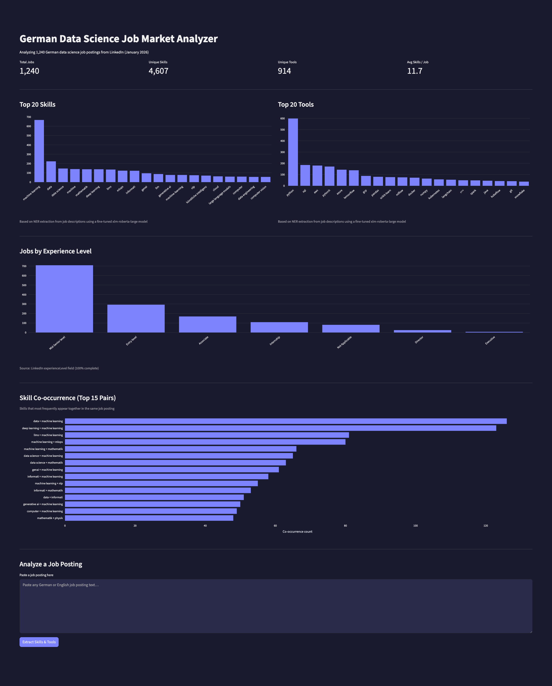

# 🇩🇪 German Data Jobs Analyzer

> Eine mehrsprachige NLP-Pipeline, die Skills und Tools aus 1.240 deutschen und englischen Data-Science-Stellenanzeigen extrahiert – mithilfe eines feinabgestimmten Named-Entity-Recognition-Modells und einem interaktiven Streamlit-Dashboard zur Visualisierung des deutschen KI/ML-Arbeitsmarkts.



---

## 📊 Wichtige Erkenntnisse

Analyse von **1.240 LinkedIn-Stellenanzeigen** für Data Science, Machine Learning und KI-Rollen in Deutschland (Januar 2026):

- **Python dominiert**: In ~48 % aller Stellenanzeigen erwähnt – die klare Grundvoraussetzung im deutschen Markt
- **LLMs sind Mainstream**: GenAI, LLMs und RAG treten häufig gemeinsam auf – Generative KI ist keine Nischenanforderung mehr
- **Das Cloud-Trio**: AWS (180), Azure (143) und GCP (88) sind alle stark vertreten – Cloud-Kompetenz wird erwartet, nicht als Bonus gewertet
- **MLOps auf dem Vormarsch**: MLflow, Kubeflow und MLOps als Skill erscheinen häufig, besonders in Mid-Senior-Rollen – ein Zeichen für die zunehmende Reife im ML-Deployment
- **PyTorch vs. TensorFlow**: PyTorch (171) liegt vor TensorFlow (138), insbesondere auf Entry- und Mid-Senior-Niveau
- **Deutschsprachige Stellenanzeigen sind Realität**: 44 % der analysierten Anzeigen sind auf Deutsch – mehrsprachiges NLP ist praktisch relevant, nicht nur akademisch interessant
- **Durchschnittlich 11,7 Skills und 4 Tools** pro Stelle – Rollen werden zunehmend hybrid und funktionsübergreifend

---

## 🏗️ Architekturübersicht

```
Rohe Stellenanzeigen (1.240)
        │
        ▼
┌─────────────────────────┐
│  LLM-Vorannotierung     │  Llama 3.1 8B via Ollama
│  (150 Stichproben)      │  Extrahiert Kandidaten für Skills/Tools
└────────────┬────────────┘
             │
             ▼
┌─────────────────────────┐
│  Manuelle Überprüfung   │  Label Studio (lokaler Docker)
│  (IOB-Korrektur)        │  Sichert Annotationsqualität
└────────────┬────────────┘
             │
             ▼
┌─────────────────────────┐
│  NER-Feinabstimmung     │  xlm-roberta-large
│  (150 annotierte Jobs)  │  Training auf Apple Silicon (MPS)
└────────────┬────────────┘
             │
             ▼
┌─────────────────────────┐
│  Inferenz-Pipeline      │  NER auf allen 1.240 Anzeigen
│                         │  4.607 einzigartige Skills extrahiert
│                         │  914 einzigartige Tools extrahiert
└────────────┬────────────┘
             │
             ▼
┌─────────────────────────┐
│  Streamlit-Dashboard    │  Interaktive Visualisierung
│                         │  Filter nach Erfahrungslevel
│                         │  Analyse eigener Stellenanzeigen
└─────────────────────────┘
```

---

## 🛠️ Tech-Stack

| Komponente | Wahl | Begründung |
|------------|------|------------|
| Basis-NER-Modell | `xlm-roberta-large` | Verarbeitet Deutsch + Englisch nativ |
| LLM-Vorannotierung | Llama 3.1 8B (Ollama) | Lokal, kostenlos, schnell für Annotation-Bootstrapping |
| Annotationstool | Label Studio | Open Source, ausgezeichnete NER-Unterstützung |
| Dashboard | Streamlit | Schnell umsetzbar, professionelles Ergebnis |
| Trainings-Hardware | Apple M4 (MPS-Beschleunigung) | Lokales Finetuning, keine Cloud-Kosten |
| Entwicklung | Docker + VS Code Dev Containers | Reproduzierbare Umgebung |

---

## 📈 Modellperformance

### Trainingskonfiguration

| Parameter | Wert |
|-----------|------|
| Basismodell | `xlm-roberta-large` (559M Parameter) |
| Epochen | 10 |
| Effektive Batchgröße | 8 (Batch 2 + Gradient Accumulation 4) |
| Lernrate | 2e-5 |
| Hardware | Apple M4 MPS |
| Modellauswahl | Höchstes Validierungs-F1 |

### Datensatz-Aufteilung

| Split | Samples |
|-------|---------|
| Training | 105 |
| Validierung | 22 |
| Test | 23 |

### Ergebnisse auf dem Testset

| Metrik | Wert |
|--------|------|
| **F1** | **0,666** |
| Precision | 0,644 |
| Recall | 0,690 |
| Token-Accuracy | 0,880 |

> **Einordnung der Werte:** Ein Recall von 0,69 liegt leicht über der Precision von 0,64 — das Modell findet die meisten Entitäten, extrahiert gelegentlich aber auch Grenzfälle. Für eine Marktanalyse im großen Maßstab ist das ein sinnvoller Kompromiss: Fehlende Skills wiegen schwerer als das gelegentliche Überextrahieren.
>
> Ein F1-Wert von 0,67 ist bei 105 Trainingsbeispielen für ein 559M-Parameter-Modell auf verrauschtem, mehrsprachigem Text erwartbar. Die Token-Accuracy von 0,88 spiegelt wider, dass die meisten Tokens korrekt als `O` (keine Entität) klassifiziert werden — die natürliche Klassenverteilung bei NER. Mit 500+ annotierten Beispielen würde die Performance deutlich steigen. Die Pipeline demonstriert den vollständigen Feinabstimmungsprozess; das Modell ist für eine Portfolio-Analyse geeignet.
>
> **Hinweis zur Hardware:** Das Training erforderte Gradient Checkpointing und eine Reduktion der Batchgröße (8→2 mit Akkumulation), um in den Apple M4 MPS-Speicher zu passen.

---

## 🚀 Installation und Ausführung

### Voraussetzungen
- Docker + VS Code mit Dev Containers Extension
- Python 3.11+

### Setup

```bash
# Repository klonen
git clone https://github.com/razanmasood/german-data-job-analyzer
cd german-data-job-analyzer

# In VS Code Dev Container öffnen
code .
# Dann: Strg+Shift+P → "Reopen in Container"
```

### Dashboard starten

```bash
streamlit run app/dashboard.py
```

Öffne `http://localhost:8501` im Browser.

### Vollständige Pipeline ausführen (optional)

```bash
# 1. Vorannotierung mit LLM (erfordert Ollama + llama3.1:8b)
python src/annotation/llm_annotator.py

# 2. Annotierungen in IOB-Format konvertieren
python src/annotation/convert_to_iob.py

# 3. NER-Modell feinabstimmen
python src/training/train_ner.py

# 4. Inferenz auf allen Stellenanzeigen ausführen
python src/inference/run_inference.py
```

---

## 📁 Projektstruktur

```
german-data-job-analyzer/
├── app/
│   └── dashboard.py          # Streamlit-Dashboard
├── src/
│   ├── annotation/           # LLM-Vorannotierung + IOB-Konvertierung
│   ├── training/             # NER-Feinabstimmung mit xlm-roberta-large
│   └── inference/            # Inferenz-Pipeline für alle 1.240 Jobs
├── data/
│   ├── raw/                  # Originale LinkedIn-Stellenanzeigen
│   ├── annotated/            # 150 manuell überprüfte Annotationen
│   └── analyzed/             # results.json mit extrahierten Skills/Tools
├── assets/
│   └── screenshots/          # Dashboard-Screenshots
├── .devcontainer/            # VS Code Dev Container Konfiguration
└── README.md
```

---

## 🔍 Datensatz

- **Quelle**: LinkedIn-Stellenanzeigen, gesammelt via Octoparse (Januar 2026)
- **Gesamtanzahl**: 1.240 Anzeigen (dedupliziert nach Job-ID)
- **Sprachen**: 56 % Englisch, 44 % Deutsch
- **Rollen**: Data Scientist, ML Engineer, AI Engineer, Data Engineer
- **Erfahrungslevel**: Entry, Associate, Mid-Senior, Director, Executive (aus LinkedIn-Metadaten)
- **Annotiertes Subset**: 150 Anzeigen (manuell in Label Studio überprüft)

---

## 💡 Designentscheidungen

**Warum ein eigenes NER-Modell statt reiner LLM-Extraktion?**
Feinabgestimmte kleinere Modelle sind bei der Inferenz auf großem Maßstab ~150× schneller und ~80× günstiger als das Durchleiten jeder Anzeige durch ein LLM. Das LLM wurde nur für das Bootstrapping der Annotationen eingesetzt, nicht für die produktive Extraktion.

**Warum LinkedIns `experienceLevel`-Feld statt eines eigenen Klassifikators?**
Das Feld war zu 100 % befüllt und enthielt saubere Daten. Einen Klassifikator zu bauen, der vorhandene Daten reproduziert, hätte Zeit verschwendet – kluge Scope-Abgrenzung ist eine echte Engineering-Kompetenz.

**Warum xlm-roberta-large statt eines deutschsprachigen Modells?**
44 % der Stellenanzeigen sind auf Englisch. Ein mehrsprachiges Modell verarbeitet beide Sprachen ohne separate Pipelines oder Spracherkennungslogik.

---

## 🔗 Verwandtes Projekt

→ [German AWS Documentation RAG](https://github.com/razanmasood/german-aws-rag) – Ein RAG-System, das AWS-Fragen auf Deutsch beantwortet, mithilfe mehrsprachiger Embeddings und AWS Bedrock.

---